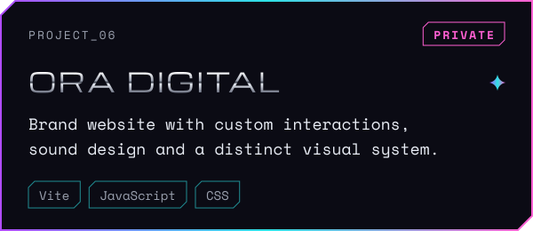

  

  I design and build web products end to end — from APIs and data to interfaces people enjoy using. Selected public and private work below. <a href="mailto:felipecarro02@gmail.com">✉ Email</a> · <a href="https://github.com/F4NT45TIC0">⌘ GitHub</a>

  <picture><source media="(max-width: 600px)" srcset="assets/about-mobile.svg" /></picture>

  

  <a href="https://github.com/F4NT45TIC0/atletica-fipp-site"><picture><source media="(max-width: 600px)" srcset="assets/cards/atletica-mobile.svg" /></picture></a>

  <picture><source media="(max-width: 600px)" srcset="assets/cards/shopflow-mobile.svg" /></picture>

  <picture><source media="(max-width: 600px)" srcset="assets/cards/ora-digital-mobile.svg" /></picture>

  

  <a href="https://dublaai-web.vercel.app"><picture><source media="(max-width: 600px)" srcset="assets/cards/dublaai-mobile.svg" /></picture></a>

  <a href="https://24a0.com.br"><picture><source media="(max-width: 600px)" srcset="assets/cards/24a0-mobile.svg" /></picture></a>

  <picture><source media="(max-width: 600px)" srcset="assets/cards/erp-otica-mobile.svg" /></picture>

Project directory · descriptions and links

- **ATLÉTICA FIPP** — Sales management system for a university athletics club. ([code](https://github.com/F4NT45TIC0/atletica-fipp-site))
- **shopflow-automator** — Local toolkit for TikTok Shop content planning and video workflows. *(private project)*
- **ORADIGITAL** — Brand website with custom interactions, sound design and a distinct visual system. *(private project)*
- **DUBLA AÍ** — In-browser dubbing studio with an honest, acoustic score. Pure DSP, no backend. ([code](https://github.com/F4NT45TIC0/dublaai) · [live demo](https://dublaai-web.vercel.app))
- **24A0** — Formula 1 race simulator that runs right in the browser. ([code](https://github.com/F4NT45TIC0/24a0) · [live demo](https://24a0.com.br))
- **ERP ÓTICA** — Multi-tenant SaaS for optical retail. Co-built, private repository. *(private project)*

  

  

  

