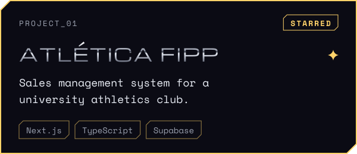
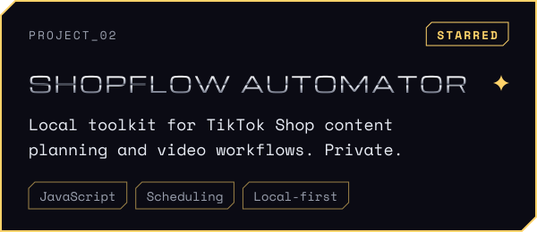
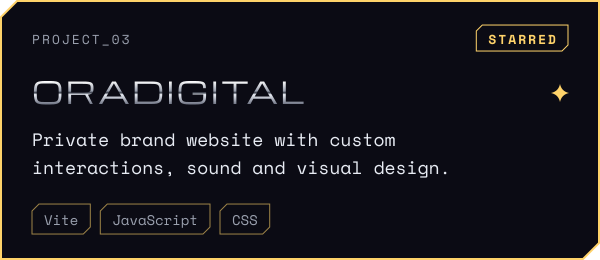
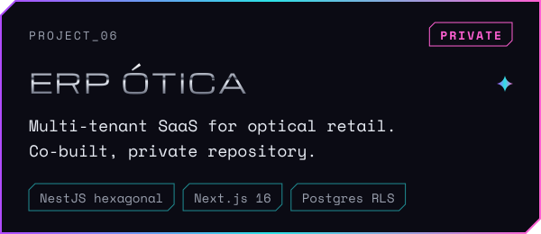
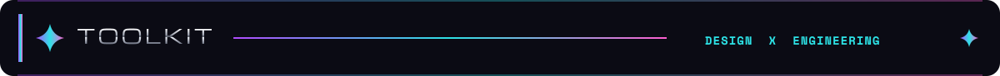
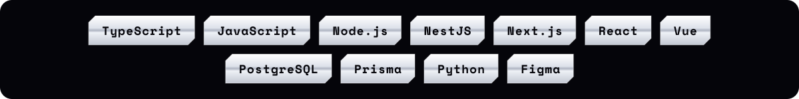
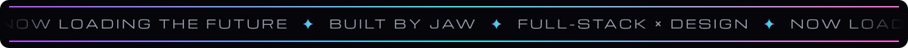

  

  

  

  
  

  
  

  
  

  

  

<!-- CONTACT — descomentar quando os links existirem (troque as URLs)

  <a href="https://www.linkedin.com/in/SEU-PERFIL">LinkedIn</a> ·
  <a href="mailto:SEU-EMAIL">E-mail</a> ·
  <a href="https://www.instagram.com/SUA-MARCA">JAW</a>

-->

  

